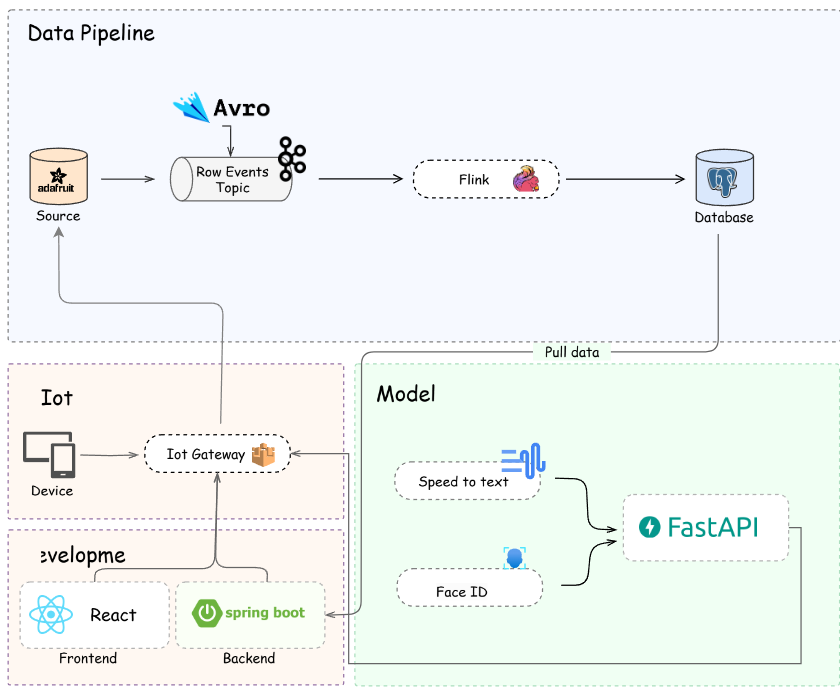

# YOLOHome - Smart Home Data Processing System

A comprehensive data processing system built with Apache Flink for smart home automation and monitoring. The system integrates various sensors, face/voice recognition capabilities, and real-time data processing.

## System Architecture



The project consists of several key components:

- **Apache Flink Processing**: Core data processing engine for real-time event handling
- **Avro Schema Definitions**: Data schemas for various sensors and devices
- **Data Generation Scripts**: Python-based data simulation tools
- **Face/Voice Recognition Module**: Advanced security and authentication features

## Technology Stack

- Apache Flink 1.18.0
- Java 8
- Python (for data generation and face/voice recognition)
- Avro for data serialization
- Docker for containerization

## Project Structure

```
├── Avro_schema/           # Avro schema definitions
│   ├── door_schema.avsc   # Door sensor schema
│   ├── fan_schema.avsc    # Fan control schema
│   ├── hum_schema.avsc    # Humidity sensor schema
│   ├── led_schema.avsc    # LED control schema
│   └── tem_schema.avsc    # Temperature sensor schema
├── Generate_data/         # Data generation scripts
│   ├── main.py
│   └── requirements.txt
├── face_voice_project/    # Face and voice recognition module
│   ├── app/
│   └── dataset/
└── src/                   # Main application source code
```

## Setup Instructions

1. **Prerequisites**
   - Java 8 or higher
   - Maven
   - Python 3.x
   - Docker and Docker Compose

2. **Build the Project**
   ```bash
   mvn clean package
   ```

3. **Setup Data Generation Environment**
   ```bash
   cd Generate_data
   pip install -r requirements.txt
   ```

4. **Setup Face/Voice Recognition**
   ```bash
   cd face_voice_project
   pip install -r requirements.txt
   ```

5. **Start the Services**
   ```bash
   docker-compose up -d
   ```

## Configuration

The system uses various configuration files:

- `docker-compose.yml`: Container orchestration settings
- Avro schemas in `Avro_schema/` directory for data structure definitions
- Environment-specific configurations in the application

## Usage

1. **Start Data Processing**
   - Deploy the Flink job using the generated JAR file
   - Monitor the Flink dashboard for processing metrics

2. **Generate Test Data**
   ```bash
   cd Generate_data
   python main.py
   ```

3. **Face/Voice Recognition System**
   - Follow the instructions in `face_voice_project/README.md`
   - Ensure the dataset directory is properly configured

## Development

- Use the provided Avro schemas for data consistency
- Follow the existing code structure and patterns
- Test thoroughly before deploying changes

## License

This project is licensed under the Apache License 2.0 - see the LICENSE file for details.